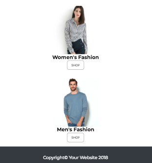

# Aliexpress

* **Curso:** _Crea tu propia red social_
* **Unidad:** _La web desde un móvil_

***

En este ejercicio se toma como base la página Aliexpress para aplicar los conceptos de diseño responsivo.

## Visualización desktop

## Visualización mobile

